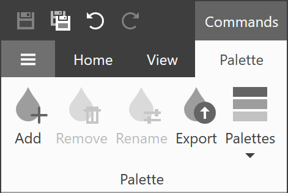
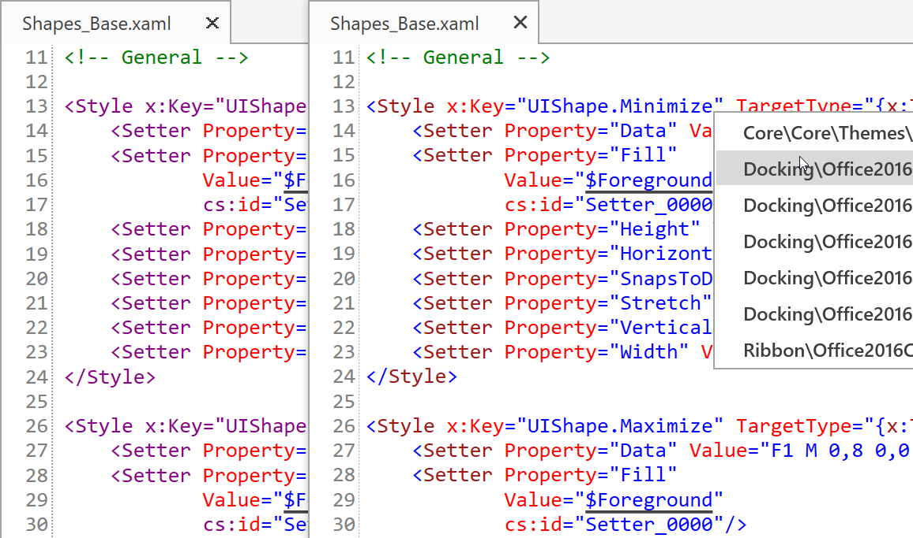

# Changelog
This file lists all the notable changes to this project.

## Theme Designer 19.1.3 - 2019-05-20

### Fixed Issues

* The *TiketNumber* issue fixed.

### Enhancements

* The 'Palette' button in the Palette ribbon tab renamed to 'Import'.

## Theme Designer 19.1.2 - 2019-04-26

### New Features

* You can create new themes based on your custom theme at runtime. Refer to the <a href="https://docs.devexpress.com/WPF/400728" target="_blank">WPF Palettes</a> topic for more information.

* Export your current theme palette to a .cs file.

    
    
* Apply a predefined palette available in the current theme.

    

    
## Theme Designer 19.1.1 - 2019-03-22

### New Features

* Incremental build.

* The Output window now can display the  **Build Output**, **Preview Output**, and **Logs**.

    

### Enhancements

* When you close a theme solution, the Theme Designer remembers the files you had open previously and restores them when you re-open the theme solution.

* The application's layout has changed to borderless.

    

* Resolve Merge Conflicts - you do not need to use the KDiff3 tool to choose a file version.

    

* New **Show in Explorer** and **Copy Path** items in the CodeView window's context menu.

    

* Visual Studio-Inspired syntax highlighting.

    
