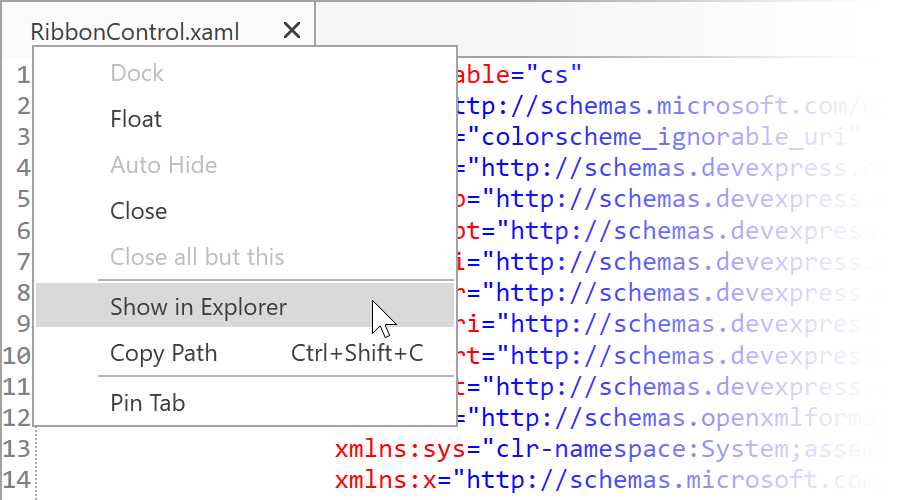

# Changelog
All notable changes to this project will be documented in this file.

## Theme Designer 19.1.1 - 2019-03-07

### New Features

* Incremental build.

* Output window now can display the  **Build Output**, **Preview Output**, and **Logs**.

    

### Enhancements

* Application layout has changed to the borderless.

* Resolve Merge Conflicts - you can choose a file version without using the KDiff3 tool.

    

* New **Show in Explorer** and **Copy Path** items in the CodeView window's context menu.

    
