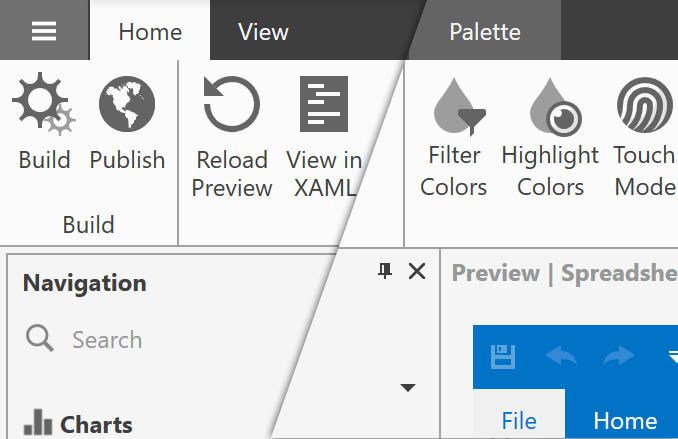

# Changelog
This file lists all the notable changes to this project.

## Theme Designer 19.1.1 - 2019-03-07

### New Features

* Incremental build.

* The Output window now can display the  **Build Output**, **Preview Output**, and **Logs**.

    

### Enhancements

* When you close a theme solution, the Theme Designer remembers the files you had open previously and restores them when you re-open the theme solution.

* The application's layout has changed to borderless.

    

* Resolve Merge Conflicts - you do not need to use the KDiff3 tool to choose a file version.

    

* New **Show in Explorer** and **Copy Path** items in the CodeView window's context menu.

    
