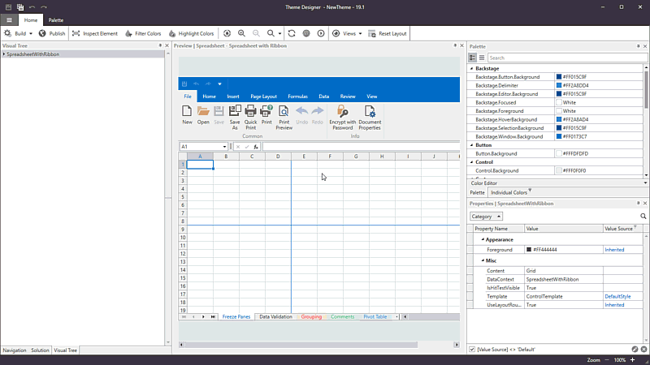

# Changelog
This file lists all the notable changes to this project.

## Theme Designer 19.2.1 - 2019-09-06

### New Features

* The [Visual Tree Window](http://docs.devexpress.com/WpfThemeDesigner/401169/workspace/visual-tree-window) displays the current preview's visual element structure.

    

* The [Properties Window](http://docs.devexpress.com/WpfThemeDesigner/401212/workspace/properties-window) displays the selected element's properties.
    
    

* The **Ignore System DPI** tool ignores the system's scaling value and displays the preview with 100% scale. 

### Bug Fixes

* <a href="https://www.devexpress.com/Support/Center/Question/Details/T754663/theme-designer-the-preview-window-is-corrupted-when-the-custom-theme-name-is">T754663</a> - The preview window is corrupted when the custom theme name is Office2019Colorful.

* <a href="https://www.devexpress.com/Support/Center/Question/Details/T719715/theme-designer-preview-is-empty-in-certain-cases">T719715</a> - Theme Designer Preview is empty in certain cases.

### Enhancements

* **View in XAML** tool is renamed to the **Inspect Element** tool. The **Inspect Element** tool allows you to select a UI element to display its properties, XAML code, and its position in the Visual Tree.

    

* The palette color's tooltips added to the CodeView Window's Intelligent Code Completion popup window.

    

### Changes

* The **Filter Colors** tool now displays only the colors the **selected element and its children** uses. You can use the Inspect Element tool or the **Visual Tree Window** to select an element.

* Theme Designer now uses the Ribbon's Simplified mode.

    

* The **Reset Layout** tool has been moved to the 'Home' ribbon tab.
* The **Views** ribbon tab has been converted to the drop-down button and moved to the 'Home' ribbon tab.

## Theme Designer 19.1.4 - 2019-05-27

### Bug Fixes

* <a href="https://www.devexpress.com/Support/Center/Question/Details/T743008/theme-designer-cannot-upgrade-a-theme-because-the-x-namespace-prefix-is-not-defined-in">T743008</a> - Theme Designer cannot upgrade a theme because the 'x' namespace prefix is not defined in certain files.

## Theme Designer 19.1.3 - 2019-05-17

### Changes

* The 'Palettes' button in the Palette ribbon tab is renamed to 'Import'.

    

### Enhancements

* Internal enhancements and bug fixes.

## Theme Designer 19.1.2 - 2019-04-26

### New Features

* You can create new themes based on your custom theme at runtime. Refer to the <a href="https://docs.devexpress.com/WPF/400728" target="_blank">WPF Palettes</a> topic for more information.

* Export your current theme palette to a .cs file.

    
    
* Apply a predefined palette available in the current theme.

    

    
## Theme Designer 19.1.1 - 2019-03-22

### New Features

* Incremental build.

* The Output window now can display the  **Build Output**, **Preview Output**, and **Logs**.

    

### Enhancements

* When you close a theme solution, the Theme Designer remembers the files you had open previously and restores them when you re-open the theme solution.

* The application's layout has changed to borderless.

    

* Resolve Merge Conflicts - you do not need to use the KDiff3 tool to choose a file version.

    

* New **Show in Explorer** and **Copy Path** items in the CodeView window's context menu.

    

* Visual Studio-Inspired syntax highlighting.

    
