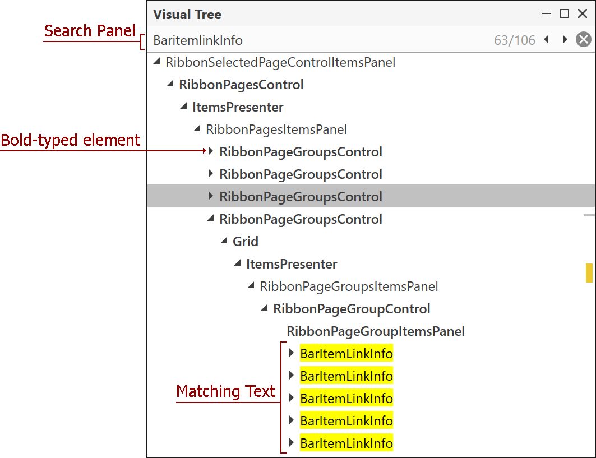
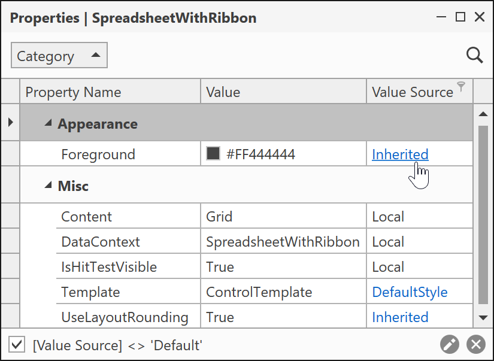
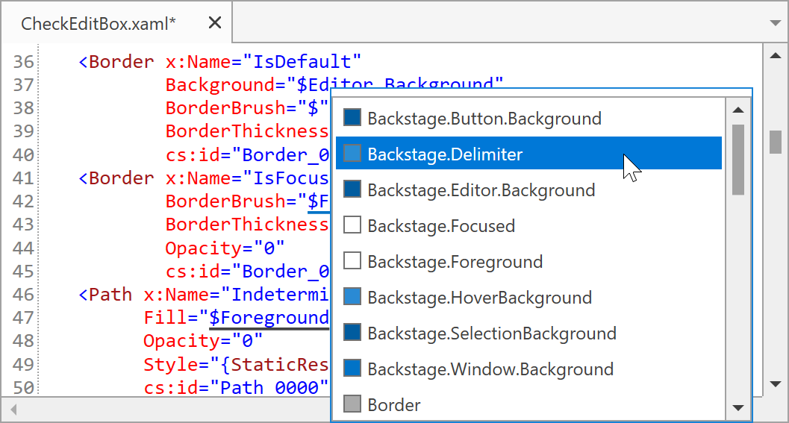
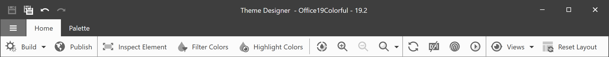
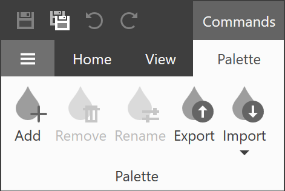
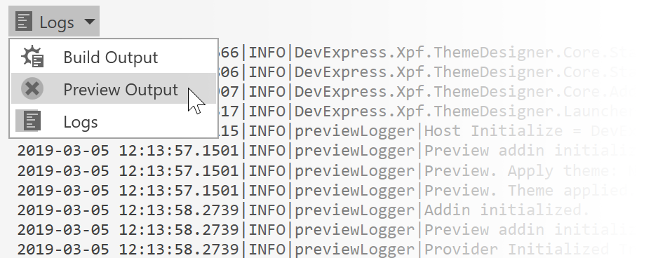
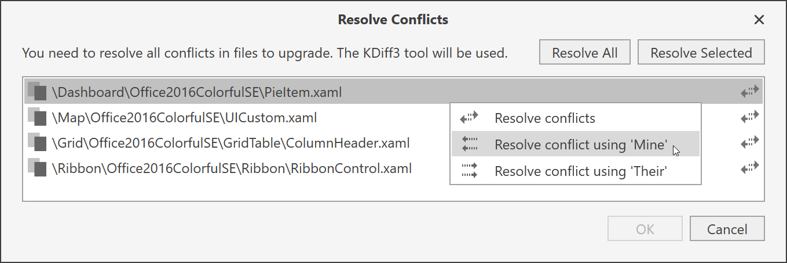

# Changelog
This file lists the important changes to this project.

## Theme Designer 22.2.1 - 2022-12-12
### Enhancements
Theme Designer now supports the new DevExpress <a href="https://docs.devexpress.com/WPF/7407/common-concepts/themes/theme-list?v=22.2#windows-11-themes">Win11Dark</a> theme.
### Bug Fixes
* <a href="https://supportcenter.devexpress.com/ticket/details/T1128495">T1128495</a> - Theme Designer crashes on an attempt to click in its visual elements.

## Theme Designer 22.1.1 - 2022-28-05
### Enhancements
Theme Designer now supports the new DevExpress <a href="https://docs.devexpress.com/WPF/7407/common-concepts/themes/theme-list?v=22.1#windows-11-themes">Win11Light</a> theme.
### Bug Fixes
* <a href="https://supportcenter.devexpress.com/ticket/details/T1081125">T1081125</a> - Theme Designer cannot open previews for PropertyGridControl in themes created for old DevExpress versions.

## Theme Designer 21.2.2 - 2022-14-02
### Bug Fixes
* <a href="https://supportcenter.devexpress.com/ticket/details/T1062507">T1062507</a> - Images in a sub-folder in the Source directory become broken after upgrading a theme

## Theme Designer 21.2.1 - 2021-15-10
### Enhancements

Theme Designer now supports the new DevExpress <a href="https://docs.devexpress.com/WPF/7407/common-concepts/themes/theme-list?v=21.2#windows-10-themes">Win10Dark</a> theme and Enhanced Contrast <a href="http://docs.devexpress.devx/WPF/400728/common-concepts/themes/palettes?v=21.2#predefined-palettes">palettes</a> for [Office 2016 SE](https://docs.devexpress.com/WPF/7407/common-concepts/themes/theme-list?v=21.2#office-2016-se-themes), [Visual Studio 2017](https://docs.devexpress.com/WPF/7407/common-concepts/themes/theme-list?v=21.2#visual-studio-2017-themes), [Office 2019](https://docs.devexpress.com/WPF/7407/common-concepts/themes/theme-list?v=21.2#office-2019-themes), and [Visual Studio 2019](https://docs.devexpress.com/WPF/7407/common-concepts/themes/theme-list?v=21.2#visual-studio-2019-themes)	DevExpress Themes.

## Theme Designer 21.1.2 - 2021-28-07
### Changes

The MSBuild updated to the v16.10.
 
### Bug Fixes
* <a href="https://supportcenter.devexpress.com/ticket/details/T1016630">T1016630</a> - tdcli.exe generates faulty source code 
* <a href="https://supportcenter.devexpress.com/ticket/details/T1001880">T1001880</a> - Theme Designer cannot build a theme when Directory.Build.props contains LangVersion=9

## Theme Designer 21.1.1 - 2021-21-04
### Bug Fixes
* <a href="https://supportcenter.devexpress.com/ticket/details/T939497">T939497</a> - Theme Designer cannot open a theme after an upgrade if certain files are read-only 

## Theme Designer 20.2.1 - 2020-01-10
### Enhancements

Theme Designer now supports the new DevExpress <a href="https://docs.devexpress.com/WPF/7407/common-concepts/themes/theme-list?v=20.2#windows-10-themes">Win10Light</a> theme and DevExpress Visual Studio 2019 <a href="http://docs.devexpress.devx/WPF/400728/common-concepts/themes/palettes?v=20.2#predefined-palettes">palettes</a>.

## Theme Designer 20.1.3 - 2020-29-04
Bugs fixes and miscellaneous enhancements.

## Theme Designer 20.1.2 - 2020-09-04
### Bug Fixes
* <a href="https://supportcenter.devexpress.com/ticket/details/T862806">T862806</a> - Make it possible to export a theme when DevExpress components are not installed

### Enhancements

* Theme Designer now supports the new DevExpress Visual Studio 2019 themes.

## Theme Designer 20.1.1 - 2020-06-03

### New Features

* CodeView - context menu includes Cut, Copy, and Paste commands.

### Changes

* The Theme Designer now targets the .NET Framework 4.8. 
* The MSBuild updated to the v16.4.

### Enhancements

* Incremental build performance enhanced.

## Theme Designer 19.2.5 - 2019-20-12

### New Features

* Command Line Interface (CLI) allows you to clone and export theme solutions. You can use the CLI on a build server and then build the theme solution with [msbuild](https://docs.microsoft.com/en-us/visualstudio/msbuild/msbuild).

    Refer to the <a href="https://docs.devexpress.com/WpfThemeDesigner/401518/command-line">Command Line Interface</a> topic for more information.

## Theme Designer 19.2.4 - 2019-25-11
### Bug Fixes

* <a href="https://www.devexpress.com/Support/Center/Question/Details/t835710/the-wpf-theme-designer-preview-is-not-displayed-if-the-target-version-is-17-2">t835710</a> - The WPF Theme Designer preview is not displayed if the target version is 17.2 

## Theme Designer 19.2.3 - 2019-12-11
### Bug Fixes

* <a href="https://www.devexpress.com/Support/Center/Question/Details/T830995/themedesigner-does-not-launch-the-complex-preview">T830995</a> - ThemeDesigner does not launch the complex preview

## Theme Designer 19.2.2 - 2019-01-10

### Bug Fixes

* <a href="https://www.devexpress.com/Support/Center/Question/Details/T816015/show-error-messages-when-the-output-window-is-hidden">T816015</a> - Show error messages when the Output window is hidden

* <a href="https://www.devexpress.com/Support/Center/Question/Details/T719715/theme-designer-preview-is-empty-in-certain-cases">T719715</a> - Theme Designer shows an empty preview in certain cases

## Theme Designer 19.2.1 - 2019-12-09

### New Features

* The [Visual Tree Window](http://docs.devexpress.com/WpfThemeDesigner/401169/workspace/visual-tree-window) displays the preview's visual element structure.

    

* The [Properties Window](http://docs.devexpress.com/WpfThemeDesigner/401212/workspace/properties-window) displays the selected element's properties.
    
    

* The **Ignore System DPI** tool ignores the system's scaling value and displays the preview with 100% scale. 

### Enhancements

* A palette color's tooltips are added to the CodeView's Intelligent Code Completion pop-up window.

    

### Bug Fixes

* <a href="https://www.devexpress.com/Support/Center/Question/Details/T754663/theme-designer-the-preview-window-is-corrupted-when-the-custom-theme-name-is">T754663</a> - The preview window is corrupted when the custom theme name is Office2019Colorful

### Changes
* The **View in XAML** tool was replaced with the **Inspect Element** tool. **Inspect Element** allows you to select a UI element and display its properties, XAML code, and position in the Visual Tree.

* The **Filter Colors** tool now displays only the colors from the **selected element and its children**. You can use the Inspect Element tool or **Visual Tree Window** to select an element.

* The Theme Designer now uses the Ribbon's Simplified mode.

    

* The **Reset Layout** tool was moved to the 'Home' ribbon tab.
* The **Views** ribbon tab was converted to a drop-down button and moved to the 'Home' ribbon tab.

## Theme Designer 19.1.4 - 2019-27-05

### Bug Fixes

* <a href="https://www.devexpress.com/Support/Center/Question/Details/T743008/theme-designer-cannot-upgrade-a-theme-because-the-x-namespace-prefix-is-not-defined-in">T743008</a> - The Theme Designer cannot upgrade a theme because the 'x' namespace prefix is not defined in certain files.

## Theme Designer 19.1.3 - 2019-17-05

### Changes

* The 'Palettes' button in the Palette ribbon tab was renamed to 'Import'.

    

### Enhancements

* Internal enhancements and bug fixes.

## Theme Designer 19.1.2 - 2019-26-04

### New Features

* You can create new themes based on your custom theme at runtime. Refer to the <a href="https://docs.devexpress.com/WPF/400728" target="_blank">WPF Palettes</a> topic for more information.

* Export your current theme palette to a .cs file.

    
    
* Apply a predefined palette available in the current theme.

    

    
## Theme Designer 19.1.1 - 2019-22-03

### New Features

* Incremental build.

* The Output window now can display the  **Build Output**, **Preview Output**, and **Logs**.

    

### Enhancements

* When you close a theme solution, the Theme Designer remembers the files you had open previously and restores them when you re-open the theme solution.

* The application's layout has changed to borderless.

    

* Resolve Merge Conflicts - you do not need to use the KDiff3 tool to choose a file version.

    

* New **Show in Explorer** and **Copy Path** items in the CodeView window's context menu.

    

* Visual Studio-Inspired syntax highlighting.

    
