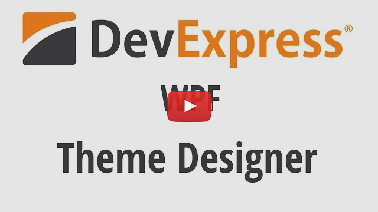

<h1 align="center">
        
</h1>

<a href="https://docs.devexpress.com/WpfThemeDesigner/118707/index">Documentation</a> | <a href="https://www.devexpress.com/Products/NET/Controls/WPF/Themes/">Website</a> | <a href="CHANGELOG.md">Changelog</a>

<i>The DevExpress WPF Theme Designer simplifies theme customization and allows you to quickly   develop custom themes by altering the base colors of existing DevExpress Themes.
</i>

----
## Table of Contents

* [Overview](#overview)
* [Features](#features)
* [Getting Started](#getting-started)
* [.NET Core 3 Support](#net-core-3-support)
* [Get Help](#get-help)

## Overview
The DevExpress WPF Theme Designer was designed to reduce the grunt work associated with custom app-wide theme development. It is a free standalone tool that allows you to generate custom themes by altering the base colors of existing DevExpress WPF Themes.

## Features
* [Theme Customization](https://docs.devexpress.com/WpfThemeDesigner/119320/workspace/tools)   The Theme Designer offers a number of features designed to improve your editing experience. Pick colors from any on-screen application, filter element colors and use other new tools to easily colorize any visual element of your application.

* [Palette](https://docs.devexpress.com/WpfThemeDesigner/400319/edit-colors)   The latest DevExpress Themes contain a palette. 

* [XAML Edit](https://docs.devexpress.com/WpfThemeDesigner/400298/edit-theme-in-xaml)   The WPF Theme Designer empowers you to locate and modify control templates, styles and apply color presets. You can edit XAML files in the built-in Code View, or open the theme solution in Visual Studio.

* Live Preview   Flexibility is at the heart of our WPF Theme Designer. Once you've made your changes, you don't need to rebuild your entire project to view the result. A comprehensive set of previews and an ability to preview changes in control and demo views give you complete picture of your theme's appearance. Simply use the Designer's Preview window to evaluate the usability of your new Theme.

* [Import. Export. Share.](https://docs.devexpress.com/WpfThemeDesigner/118787/build-and-export-new-themes)   The WPF Theme Designer ships with multiple options to save modified themes and retain them for later use. New themes can be built as assemblies or saved to a *.tdsln file. All changes made to individual color schemes remain consistent whenever you upgrade to a newer version of DevExpress WPF Controls.

* [Visual Tree](https://docs.devexpress.com/WpfThemeDesigner/401169/workspace/visual-tree-window)   The Visual Tree Window displays the current preview's visual element structure. You can find a UI element with the built-in Search bar and navigate to the element's XAML.

* [Command Line Interface](https://docs.devexpress.com/WpfThemeDesigner/401518/command-line)   The Theme Designer Command Line Interface (CLI) allows you to clone and export theme solutions. You can use the CLI on a build server and then build the theme solution with [msbuild](https://docs.microsoft.com/en-us/visualstudio/msbuild/msbuild).

## Getting Started

Download and install the WPF Theme Designer, then [get started](https://docs.devexpress.com/WpfThemeDesigner/118594/getting-started).

## .NET Core 3 Support

The Theme Designer requires DevExpress WPF Controls for the .NET Framework to create a custom theme for .NET Core applications. Refer to the [.NET Core 3 Support](https://docs.devexpress.com/WpfThemeDesigner/401520/net-core-support) help topic for more information.

## Get Help

You can ask any question in our [Support Center](https://www.devexpress.com/Support/Center) or [Online Chat](https://www.devexpress.com/).
